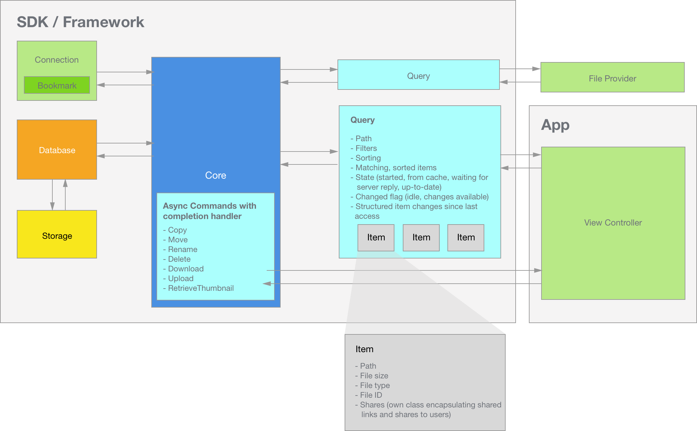

#  ownCloud iOS SDK  `WORK IN PROGRESS`

## Introduction

This project aims to create a new, modern ownCloud iOS SDK.

## Architecture

The iOS SDK comes as a framework that is easy to integrate and encapsulates all needed code and resources.

- `OCBookmark` objects contain the name and URL of an ownCloud server. It also transparently stores and provides access to credentials/tokens (e.g. OAuth2 tokens) in the iOS keychain for use with an `OCAuthenticationMethod`. Bookmark objects are used to initialize a Core (see below). Bookmark objects can also be serialized for permanently storing references to a user's servers.

- `OCConnection` objects are responsible for forming HTTP(S) and WebDAV requests, sending them to the ownCloud server (identified by a bookmark), parsing the result and returning the result back to the Core as an `OCEvent`. It also is responsible for establishing the authenticity of the server and notifying the Core about any issues it finds. In case of issues, the Core can consult with a delegate (usually implemented by the app using the SDK) and then instruct the Connection on whether to proceed or not.

- `OCDatabase` objects are responsible for storing cached information on disk and providing the Core access to it. It is also responsible for storing local copies of files. On disk, one database is used per vault/bookmark.

- `OCVault` objects provide and manage all local storage associated with a bookmark, including storage for cached thumbnails, databases, files and folders available offline. Typically, one folder is created per vault, which then organizes its data inside that folder. Since every bookmark has its own vault, removing _all_ resources related to a bookmark can be achieved simply by deleting the root directory of the vault. OCVault objects are initialized with a bookmark and usually use the bookmark's UUID to locate the vault directory and database.

- `OCQuery` objects provide an interface between the Core and apps. They encapsulate a long-running query that provides:
    - the path of the file or directory the query targets
    - filtering (via objects conforming to the `OCQueryFilter` protocol, a convenience class for using blocks is provided) that limit which items are returned (can be used to implement search or particular perspectives)
    - sorting via a NSComparator block that defines the order of the query results
    - the query's state: "idle" (no changes), "contents from cache" (results come from the database), "updating" (a request has been sent to the server - updates possible at any time)
    - "live" array of all items matching the query (queryResults).
    - a mechanism to notify a delegate (`OCQueryDelegate`) of changes, effectively providing a transactional view of changes as coalescated `OCQueryChangeSet` objects that can be used to implement animated UIs or efficient tracking of changes.

- `OCItem` objects encapsulate metadata, status information and shares (see next point) about directories and files.

- `OCShare` objects encapsulate all metadata of shared links, users with whom a file/directory was shared as well as users by whom a file/directory was shared.

- **Commands** are methods provided by the Core to asynchronously perform file operations such as copy, move, rename, delete, download, upload and retrieving thumbnails. Apps pass in Item objects and a completion handler. When the file operation has finished, the completion handler is called and related queries updated accordingly. Command methods can return an `OCActivity` that provides status information and the ability to cancel a running or scheduled command.

- `OCCore` objects tie everything together. When a new Query is added to a core, it consults the Database for immediate results - and makes requests to the server using the Connection as needed.

    When the Connection returns results, the Core runs through all running Queries, checks if the result relates to them, updates the Query's items as necessary and finally notifies the `OCQueryDelegate` that results have changed.

    It also coalesces changes, so that when a query's owner gets around to fetching the changes, the change set is as compact as possible.

### OCCore / OCConnection event handling, background transfers & persisting associated data

A hybrid solution is needed to fully leverage background transfers while making a rich, block-based API available. The `OCEvent` set of classes and types offers a solution for this.

Here's how it works:
- When `OCCore` receives a command, it generates a unique `OCEventID` and stores the completion handler passed to the command in a dictionary that maps `OCEventID`s to completion handlers.
- `OCCore` then calls the `OCConnection` method corresponding to the command it received and passes it a `OCEventTarget` object (which encapsulates the generated `OCEventID` and a globally unique event handler identifier (`OCEventHandlerIdentifier`)).
- When `OCConnection` has processed the command, it generates an `OCEvent` using the supplied `OCEventID` and sends it back to the `OCCore` using the core's unique event handler identifier (`OCEventHandlerIdentifier`)
- `OCCore` then has a chance to re-associate the event with the completion handler it stored earlier - and call it.

For background transfers, where the app could be terminated while a background `NSURLSession` still processes requests:
- `OCCore` can process the outcome of the requests (and update the database and files accordingly) independently from the existance of a completion handler.
- `OCCore` also has a chance to store additonal information it needs to process the outcome of a request: by storing that data in the database and associate it with the `OCEventID`. As it receives the result of the request as an event, it can recover and use that data using the event's `OCEventID`.

Note: since `OCEventTarget` handles the resolution and actual delivery of the event to the target, support for different mechanisms (f.ex. direct delivery to a block) can be added relatively easy through subclassing.

## To Do
- nullability annotations
- OCDatabase details
- OCEvent properties
- OCConnectionRequest and OCConnectionQueue details
- Evaluate chances to consolidate existing OCItem properties, add missing ones
- complete list of ToDos ;-)
- implementation :-D

## License

This project is currently licensed under GPL v3.
